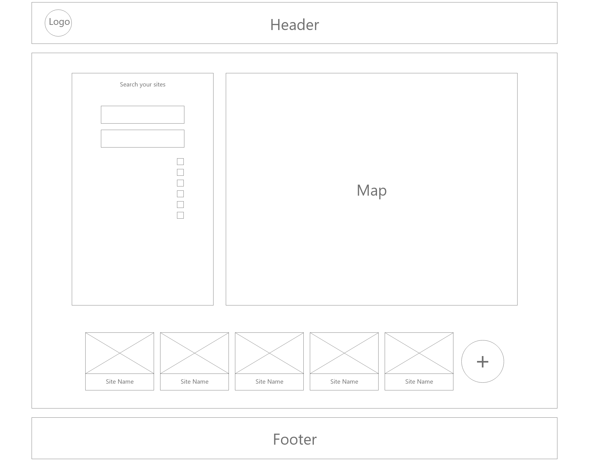
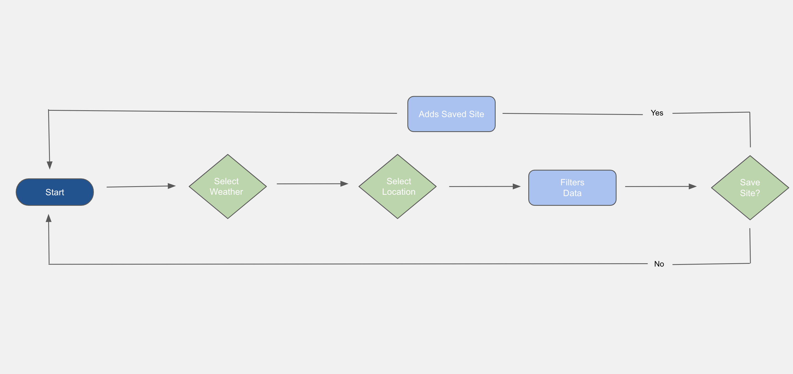

# CAMP JRNL

## Overview

As technology continues to advance, travelers of all kinds have become increasingly more dependent on travel related websites to gain valuable information regarding their desired destination. Campers in specific rely on this data to evaluate which campsite is most suitable for themselves, and those they are camping with. Camp JRNL gives prospective campers the capability to retrieve this crucial information, allowing them to make informed decisions. Furthermore, Camp JRNL allows users to submit information on campsites they have reviewed, to ultimately provide more data to new users planning their next trip! Camp JRNL serves as a reference for current and prospective campers.

## Features

- Clicking any of the options in the navigation bar will direct the user to the corresponding section of the application
- Users can filter campsites by desired weather forecast
- Users can filter campsites by desired location
- Users have the ability to select and save campsites for their convenience, the saved sites will display on a refresh/reopen
- Uses flexbox elements to obtain a fully responsive webpage, compatible with a large range of screen dimensions
- Contains "alt" phrases with descriptive titles of each image displayed, for screen readers

Link to [Live Website](https://michaelsinn.github.io/camping-journal/)

## WireFrame & WorkFlow Chart

### WireFrame

### WorkFlow Chart

## Credit

Michael Sinn
- Link to Michael's [Github Profile](https://github.com/MichaelSinn)

Trishane Wijeyawickrema
- Link to Trishane's [Github Profile](https://github.com/Trishaneww)

Imanuel Meshikhi
- Link to Imanuel's [Github Profile](https://github.com/Imanuel3)

## Liscence

N/A
